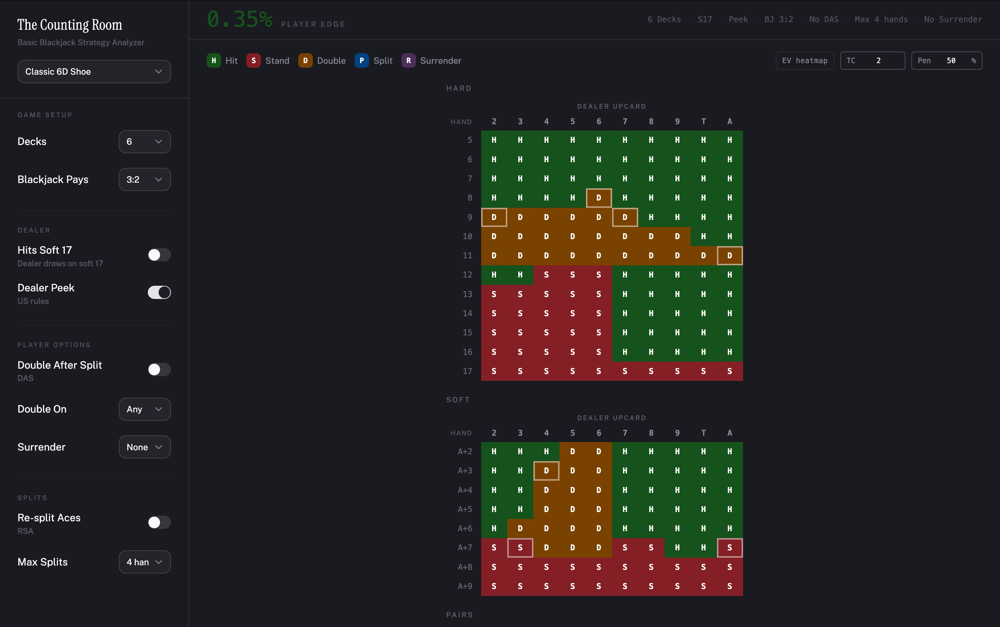

<div align="center">
  <h1>The Counting Room</h1>
  <p>Exact, EV-optimal blackjack strategy for any rule set, with live card counting</p>

  <p>
    <a href="https://www.matteopsnt.dev/blackjack-solver/">Live Demo →</a>
  </p>

  <p>
    
    
    
    
  </p>
</div>

<br/>



<br/>

Most blackjack strategy charts are static lookup tables. This one recomputes every cell from scratch: EV recursion over the actual shoe composition, so changing a rule or entering a true count gives you real numbers.


---

## Features

- Finite-deck EV model with without-replacement probabilities for 1–8 decks, so single-deck S17 and 6-deck H17 games actually compute differently
- Enter a true count and penetration percentage to see which plays change at that count, highlighted with a white inset ring
- Hover any cell for a full EV breakdown across all legal actions, ranked
- Live house/player edge in the top banner, recalculated on every rule change
- 9 configurable rule settings with presets for common games

| Setting | Options |
|---|---|
| Decks | 1, 2, 4, 6, 8 |
| Blackjack pays | 3:2 · 6:5 |
| Dealer hits soft 17 | H17 · S17 |
| Dealer peek | US rules · ENHC |
| Double after split | On · Off |
| Double restriction | Any · 9–11 · 10–11 |
| Surrender | None · Late · Early |
| Re-split aces | On · Off |
| Max splits | 2 · 3 · 4 hands |

Presets: Classic 6D Shoe, Common U.S. Shoe, Single/Double Deck Pitch, Vegas Strip 6:5, Atlantic City, European ENHC.

---

## Usage

Pick a preset or configure rules manually. The grid shows the optimal play for each hand vs dealer upcard across Hard, Soft, and Pairs.

For count-adjusted strategy, type into the `TC` field (arrow keys step by 0.1) and set `Pen` to the table's penetration. Cells that differ from basic strategy light up with a white ring.

Toggle **EV heatmap** to switch from action colours to a red-to-green gradient by expected value. Hovering any cell shows the full EV breakdown.

---

## How the engine works

```
Shoe composition -> Dealer outcome probabilities -> EV per action -> Optimal action
```

Dealer probabilities are computed via memoized recursion, removing each drawn card from the remaining shoe. EV is then calculated for each `(hand, dealer_upcard)` cell:

| Function | Description |
|---|---|
| `evStand` | Weighted sum over dealer outcome distribution |
| `evHit` | Recursive: draw each card, update hand, call `evOptimal` |
| `evDouble` | `2 × evHit` on exactly one more card |
| `evSplit` | Recursive post-split EV, respecting DAS, RSA, and max-hands rules |
| `evSurrender` | Always `−0.5` |

`evOptimal` picks the highest-EV legal action. Hit recursion is memoized on `(total, isSoft)` per dealer context — the same approximation used by professional solvers, with < 0.05% error even at one deck.

House edge sums player EV over all starting hands, weighted by their two-card probability from the without-replacement shoe.

Count mode derives running count from the true count at the given penetration, then reconstructs a Hi-Lo shoe composition with low cards reduced and high cards increased proportionally.

---

## Getting started

```bash
pnpm install
pnpm dev
```

```bash
pnpm test       # 497 tests, verified against Wizard of Odds basic strategy
pnpm build      # TypeScript typecheck + Vite production build
```

---

## Tech

React 19 · TypeScript · Vite · Tailwind CSS 4 · Zustand · Vitest
